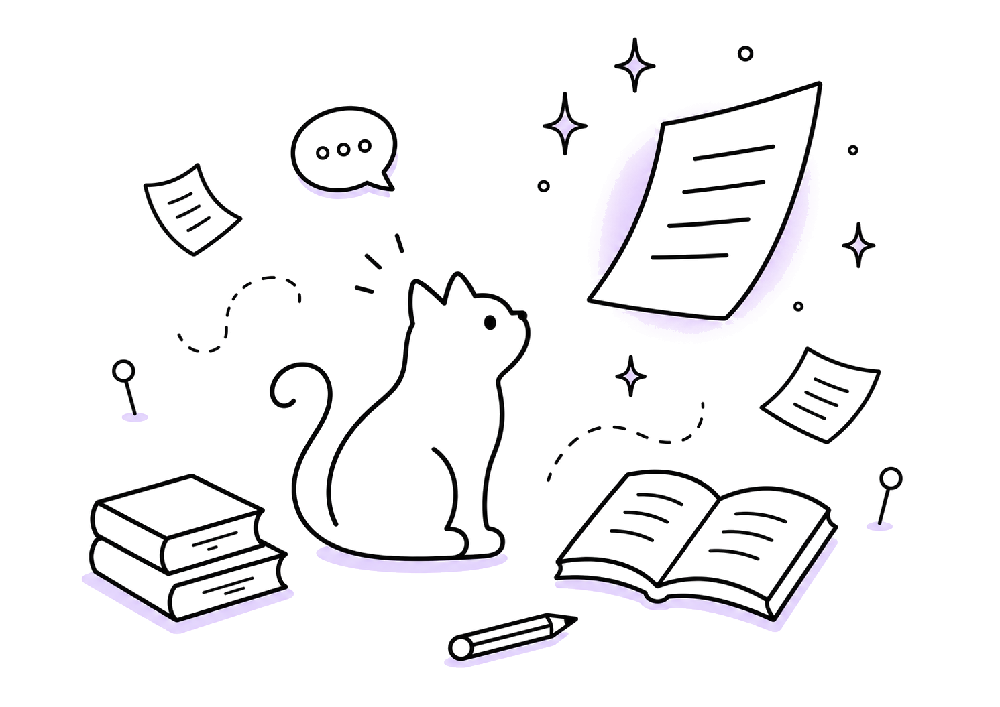

  

<h1 align="center">妙悟</h1>

  <strong>学会你的写作风格，替你落笔</strong> 
  面向中文内容创作者的 AI 写作工具

  <a href="#-产品介绍">产品介绍</a> ·
  <a href="#-核心能力">核心能力</a> ·
  <a href="#-使用流程">使用流程</a> ·
  <a href="#-适用场景">适用场景</a> ·
  <a href="#-产品理念">产品理念</a> ·
  <a href="#-常见问题">FAQ</a>

---

## 💡 产品介绍

**妙悟**是一款面向中文内容创作者的 AI 写作工具。

市面上的 AI 写作工具，大多帮你「写爆文」——套模板、堆关键词、千篇一律。

**妙悟不一样。** 妙悟帮你写「你自己的文章」。

它会先读懂你的写作习惯——你爱用的句式、口头禅、行文节奏、表达偏好——提炼出一份只属于你的「风格画像」。之后每次写作，都是按照你的风格来生成，写出来的东西读起来就像你自己写的。

> 不是替代你，是帮你更快地做你自己。

 

---

## 🎯 核心能力

### 风格学习

从你过去的文章中，逐项拆解你的写作习惯：

| 维度 | 说明 |
|------|------|
| 句式偏好 | 长句 vs 短句、是否爱用反问、排比 |
| 用词习惯 | 口语化程度、中英夹杂、专业术语 |
| 语气调性 | 温和 vs 犀利、正式 vs 随意 |
| 表达特征 | 金句收尾、爱用比喻、情绪节奏 |
| 结构习惯 | 开头方式、段落节奏、收尾模式 |

分析完成后，生成一份**风格画像**——这就是妙悟「记住你」的方式。

### 风格生成

给妙悟一个主题或一段素材，它会按照你的风格写出初稿：

- 短内容（笔记、动态）自动匹配轻量格式
- 长内容（文章、深度稿）自动匹配结构化格式
- 风格始终是你的，格式根据内容长度自适应

### 风格校准

觉得哪里不像你？告诉妙悟「这里太正式了」「我不会这么说」，它会持续调整，越用越像你。

---

## 🐾 使用流程

三步，开始用你的风格写作：

**第一步：喂给它你写过的文章**

粘贴几篇你以前写的文章，三五篇就够。不限平台，公众号、小红书、知乎、朋友圈长文都行。

**第二步：它学会你的风格**

妙悟从句式、用词、语气等多个维度分析你的写作习惯，生成一份只属于你的风格画像。

**第三步：给主题，出你的稿**

丢一个主题或一段素材进来，妙悟按你的风格生成初稿，改改就能发。

 

---

## 📝 适用场景

| 场景 | 怎么用 |
|------|--------|
| **小红书笔记** | 探店、好物、日常碎碎念——写出你那股随性又戳人的味儿，不是一本正经的 AI 腔 |
| **公众号长文** | 观点输出、夹叙夹议、金句收尾——你的行文节奏被完整保留，读者一眼认出是你 |
| **日更不卡壳** | 把选题和素材丢进来，先出一稿你风格的初稿，再也不用对着空白页发呆 |
| **职场文字** | 周报、复盘、对外文案，用你平时说话的方式写，专业又不端着 |

 

---

## 🌱 产品理念

### 「个人风格」不等于「平台格式」

很多工具把「风格」理解成小红书格式、公众号模板——加 emoji、堆标签、套标题公式。

妙悟认为：**风格是「你是谁」**。你的句式、你的口头禅、你的表达节奏，这些东西不会因为你今天写小红书、明天写公众号就变了。变的是格式，不变的是你。

妙悟只学你不变的部分，生成时再根据内容长度叠加合适的格式，这样无论写什么平台的内容，读起来都是你。

### 为什么不直接用 ChatGPT / DeepSeek？

通用 AI 没有「风格记忆」，每次对话从零开始。你可以在 prompt 里描述自己的风格，但：

- 描述不完整（你自己可能都说不清自己的风格特征）
- 每次都要重新说一遍
- AI 理解的和你想的往往不一样

妙悟通过**分析你的真实作品**来学习风格，比你自己描述的更准确，而且学一次，之后一直记得。

---

## ❓ 常见问题

<strong>需要提供多少篇文章才能学会我的风格？</strong>

 
3-5 篇就能生成不错的风格画像。文章越多、类型越丰富，风格学习越准确。

<strong>我的文章数据安全吗？</strong>

 
你提供的文章仅用于风格分析，不会被用于训练模型或分享给第三方。

<strong>生成的内容需要标注 AI 生成吗？</strong>

 
妙悟遵循合规要求，生成的内容会带有 AI 辅助生成标识。我们建议你在发布时根据平台规则做相应标注。

<strong>风格画像可以调整吗？</strong>

 
可以。如果生成的内容某些地方不像你，你可以反馈「哪里不像」，妙悟会据此校准风格画像。

<strong>支持哪些内容平台？</strong>

 
妙悟不绑定任何平台。你写什么平台的内容都可以用——小红书、公众号、知乎、微博、即刻、朋友圈……风格是你的，平台随你选。

---

## 📬 联系我们

如果你对妙悟感兴趣，欢迎通过以下方式联系：

- 反馈与建议：[提交 Issue](../../issues)

---

  
   
  妙悟 — 写出你的声音

